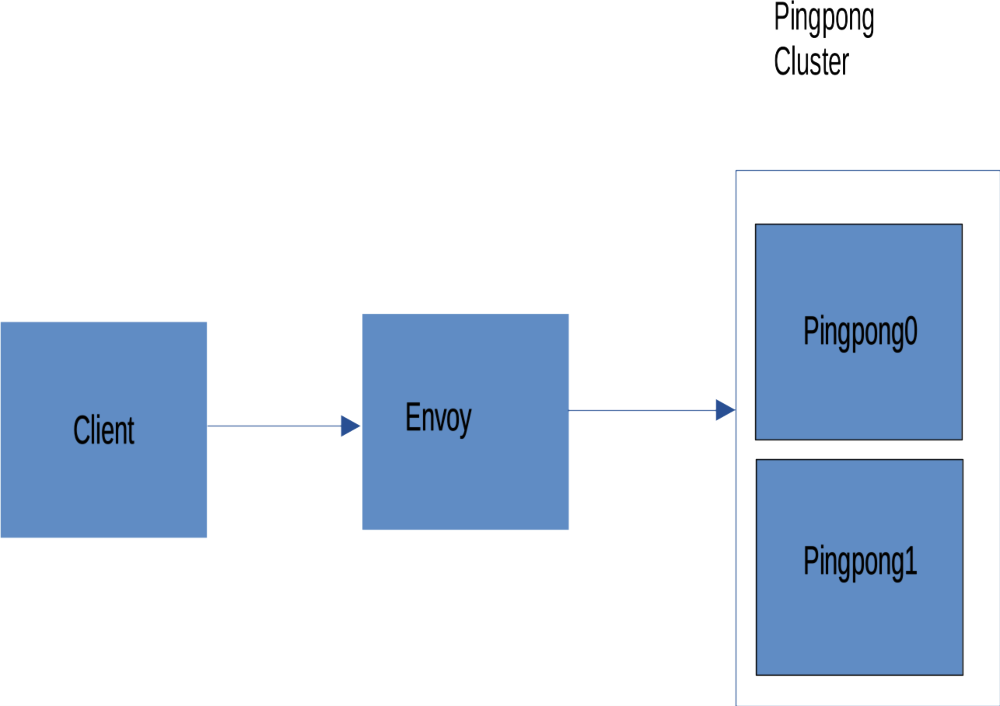

# Envoy Circuit Breaker



This is a sample project demonstrating circuit breaker pattern implemented with Envoy's **outlier detection**.
Envoy will redirect every request via port 10001 to each Pingpong host on the Pingpong Cluster, in round robin manner.

## Circuit Breaker Pattern

It's explained excellently [here](https://docs.microsoft.com/en-us/azure/architecture/patterns/circuit-breaker).

In short, if a service is outage, you wouldn't want every request that tried to reach it wait until the request is time out,
but rather tell them that the service is unavailable.

Circuit Breaker Pattern will detect for a service that failed requests multiple times in a row and will reject every
requests to the service for a period of time before turning it back on when it believe that the issue is resolved.

## Implementation with Envoy

Implementing Circuit Breaker pattern with Envoy will spare the client from having to implementing the pattern itself.

Using Envoy as a proxy sitting in front of a cluster of service hosts (Pingpong in this scenario). Envoy will proxy any requests to Pingong,
and if it detected that any host produced consecutive responses with 5xx status code beyond a specified threshold,
then it will eject the host out and only redirect requests to remaining hosts.

This is done by Envoy's outlier_detection.

```yaml
outlier_detection:
  consecutive_5xx: 2
  max_ejection_percent: 50
  base_ejection_time: 60s
```

This will eject a host if it produce 2 consecutive 500 status code for at least 60 seconds, but will eject no more than 50% of the cluster (`max_ejection_percent`).

## [Panic threshold](https://www.envoyproxy.io/docs/envoy/latest/intro/arch_overview/upstream/load_balancing/panic_threshold)

If a cluster has less than 50% of hosts available, Envoy will go into panic mode and will send requests to all hosts.
If we want to completely the the service unavailable while circuit breaker is in ON state, then we can set the cluster's panic threshold to 0%.

```yaml
common_lb_config:
  healthy_panic_threshold:
  value: 0
outlier_detection:
  max_ejection_percent: 100
```

This is demonstrated by calling `http://localhost:10001/failed`, this is an endpoint that will always response with 500 status code, multiple times or just calling Client's `http://localhost:6061/outlier` once. Envoy will eject Pingpong hosts out of the cluster and the next time any endpoint of `http://localhost:10001/` is called, Envoy will response with 503 status code immediately.

Since Pinpong host aren't actually downed, so, we can visit `http://localhost:6060/ping`, and we should get pong just fine.
